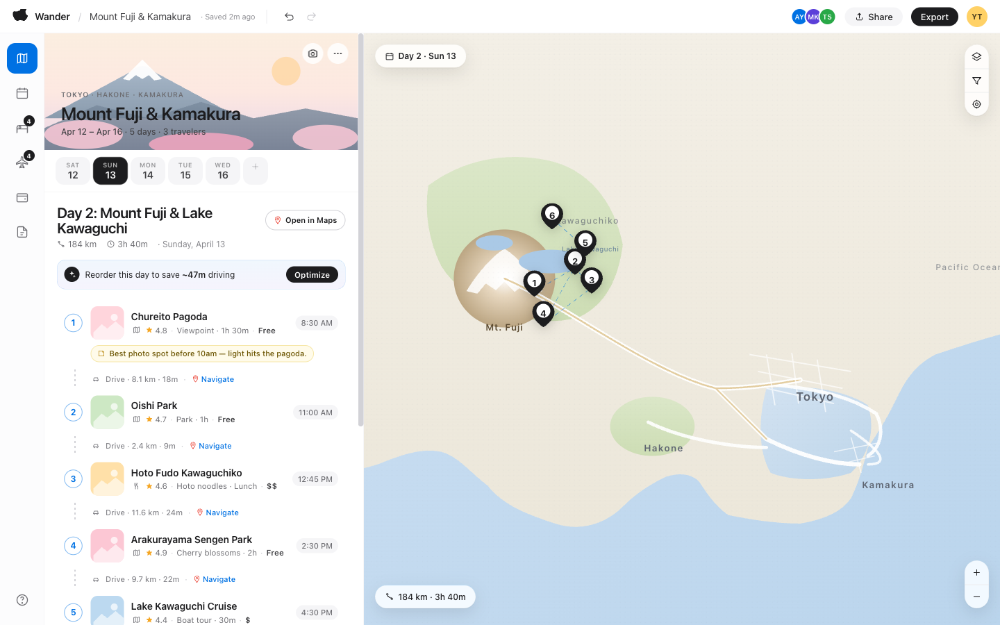

# Travel Planner v2

Wanderlog-style group travel planner. Plan multi-day trips with day-by-day
itineraries, manage hotels and transport, track shared budget, keep packing
notes, and invite collaborators.

The static HTML/CSS/JS prototype exported from
[Claude Design](https://claude.ai/design) lives in [`design/`](design/).
A real-app rebuild is planned in [`app/`](app/) — see
[REQUIREMENTS.md](REQUIREMENTS.md) for the spec and [ROADMAP.md](ROADMAP.md)
for phasing.



## Status

- **Today**: zero-build prototype in [`design/`](design/). React 18 via CDN +
  Babel standalone. All state in memory. No backend, no auth, no
  persistence. Example trip ("Mount Fuji & Kamakura · Apr 12–16, 2026")
  hardcoded in [`design/data.js`](design/data.js).
- **Next**: real-app rebuild in `app/`. Stack: Next.js 15 (App Router) +
  Drizzle + Postgres on Neon + Auth.js + Vercel. Phase 0 in progress —
  see [ROADMAP.md](ROADMAP.md).

## Quickstart (prototype)

No build step on the prototype. Two ways to serve `design/`:

```bash
# Recommended — matches .claude/launch.json, port 3001
npx serve design -l 3001

# Or
python3 -m http.server 3000 --directory design
```

Then open `http://localhost:3001/` (or `:3000`) — root resolves to
[`design/index.html`](design/index.html).

For agents: `mcp__Claude_Preview__preview_start` with name `npx-serve` reads
`.claude/launch.json` and starts the same server.

## Repo layout

| File | Role |
|------|------|
| [`index.html`](design/index.html) | Entry — links every CSS + script in order |
| [`design-tokens.css`](design/design-tokens.css) | Apple-style colour + type tokens |
| [`styles.css`](design/styles.css) | App shell, itinerary, map, place cards |
| [`bookings.css`](design/bookings.css) | Hotel/transport views + add-booking modal |
| [`other-views.css`](design/other-views.css) | Calendar, budget, notes |
| [`account.css`](design/account.css) | Dark/light theme, sign-in, account menu, settings |
| [`apple-polish.css`](design/apple-polish.css) | HIG overrides + mobile breakpoints |
| [`data.js`](design/data.js) | Trip seed data — `TRIP`, `SEARCH_RESULTS` |
| [`bookings-data.js`](design/bookings-data.js) | `BOOKINGS` (hotels + transport) |
| [`i18n.js`](design/i18n.js) | `I18N` (en/th) + `ACCOUNTS` + `INVITES` |
| [`icons.jsx`](design/icons.jsx) | `window.Ico` icon library |
| [`map.jsx`](design/map.jsx) | `MapCanvas` SVG component |
| [`place-row.jsx`](design/place-row.jsx) | `PlaceRow`, `Segment`, gmaps URL helpers |
| [`sidebar-parts.jsx`](design/sidebar-parts.jsx) | `DayHeader`, `OptimizeStrip`, `AddPlace`, `Recco`, `TripCover` |
| [`bookings-views.jsx`](design/bookings-views.jsx) | `HotelsView`, `TransportView` |
| [`add-booking-modal.jsx`](design/add-booking-modal.jsx) | Multi-step `AddBookingModal` |
| [`other-views.jsx`](design/other-views.jsx) | `CalendarView`, `BudgetView`, `NotesView` |
| [`account.jsx`](design/account.jsx) | `SignInScreen`, `AccountMenu`, `SettingsModal`, `InviteModal` |
| [`app.jsx`](design/app.jsx) | App root — state, routing, orchestration |
| [`tweaks-panel.jsx`](design/tweaks-panel.jsx) | Standalone `TweaksPanel` utility (not wired into the app; ships from design as a reusable component library) |

Conventions in the prototype:
- All components attach to `window.*` (no module system — CDN React).
- Theme switch = `data-theme` attribute on `<html>`.
- Rail view state = `itinerary` / `calendar` / `hotels` / `transport` / `budget` / `notes`.
- Mobile breakpoint at 768px → single column + bottom tab bar.

## Docs index

| Doc | What it's for |
|-----|---------------|
| [REQUIREMENTS.md](REQUIREMENTS.md) | **Read first** before code changes. Functional spec. Source of truth for the real-app rebuild. |
| [ROADMAP.md](ROADMAP.md) | Phased build plan to convert the mockup to a production app. Status snapshot, phase-by-phase DoD, owner column for tracking. |
| [AGENTS.md](AGENTS.md) | Canonical agent-facing brief — repo state, dev commands, conventions. Used by tools that follow the cross-tool `AGENTS.md` convention. |
| [CLAUDE.md](CLAUDE.md) | Thin pointer to AGENTS.md for Claude Code, plus Claude-specific extras (launch.json, gitignored paths). |
| Original Claude Design handoff README | Lives inside the export bundle (`Travel planner-handoff.zip`). Kept in user Downloads, not committed. Refer to it for the bundle's intended usage notes; the relevant content is captured in this README and CLAUDE.md. |

## Stack decision

Captured in `ARCHITECTURE.md` (Phase 0 sub-step 2 — pending). Summary:

- **Frontend** — Next.js 15 (App Router)
- **Database** — Postgres on Neon
- **ORM** — Drizzle
- **Auth** — Auth.js (NextAuth) — Google OAuth + Email magic-link
- **Maps** — Google Maps
- **Hosting** — Vercel
- **Storage** — deferred to Phase 10
- **Email** — deferred to Phase 8
- **Layout** — `design/` (prototype) + `app/` (real app), one repo, one git history

## Contributing — for coding agents

1. Read [REQUIREMENTS.md](REQUIREMENTS.md) end-to-end. The mockup is the
   source of truth for visuals + behaviour; this spec captures it in prose.
2. Read [CLAUDE.md](CLAUDE.md) for harness expectations.
3. Confirm scope before writing code. Bug fixes do not need surrounding
   cleanup; new features need a stack decision recorded somewhere.
4. Match data shapes to the entity tables in REQUIREMENTS.md §4. If a field
   is added to a `*.js` data file, update the table in the same change.
5. Do not introduce a build step on the prototype itself — keep it
   single-file-static so it stays runnable as a design reference. The
   real-app rebuild lives in a different directory or a different repo
   (TBD per stack decision).

## Contributing — for humans

Same as above. Run the server, open the URL, change a file, refresh. There
is no test runner on the prototype; visual diffing is the only check.
