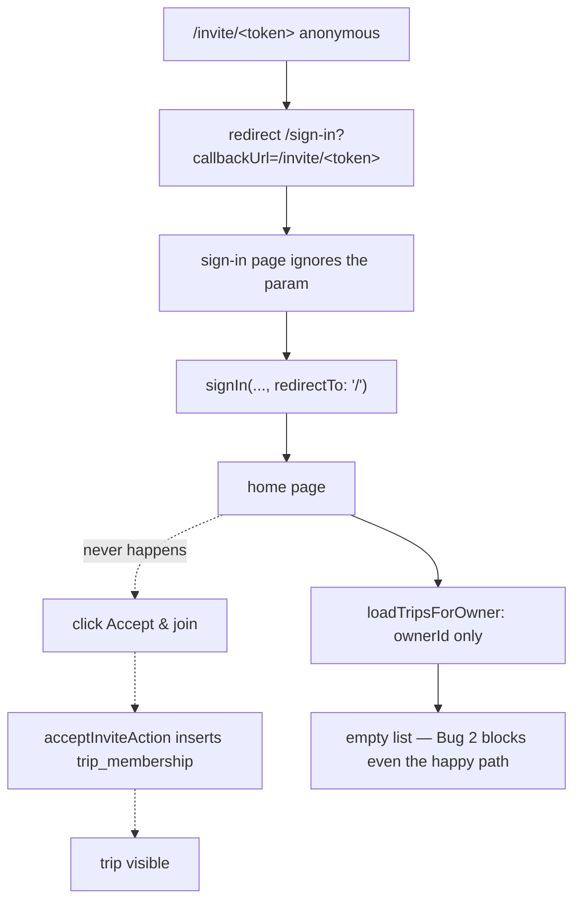

# Plan — Fix the invite-accept flow

**Ticket:** TP-00xx (to create) · **Base:** `origin/main` @ post-#52
**Status:** plan only, no code written yet

## 1. What is broken

An account invited to a trip signs up successfully but never gains access to the
trip. Verified against production data (invite row `status='pending'`,
`accepted_at IS NULL`, no `trip_membership` row) and against the code below.

Neither bug was introduced by the invite-only PR (#52) — `git diff origin/main`
shows those files untouched. #52 only made them visible, by making a pending
trip invite a valid way to register.

### Bug 1 — `/sign-in` discards `callbackUrl`

Two call sites produce the parameter:

- `app/src/app/invite/[token]/page.tsx:74`
- `app/src/app/actions/invites.ts:111`

```ts
redirect(`/sign-in?callbackUrl=${encodeURIComponent(`/invite/${token}`)}`);
```

Nothing consumes it. `app/src/app/sign-in/page.tsx` declares
`export default async function SignInPage()` — no `searchParams` prop — and both
providers hardcode the destination:

```ts
await signIn('google',     { redirectTo: '/' });
await signIn('nodemailer', { email: ..., redirectTo: '/' });
```

`grep -rn "callbackUrl" app/src` returns only the two producers. There is no
`middleware.ts` in the repo to compensate.

**Traced path:** open `/invite/<token>` anonymous → redirect to
`/sign-in?callbackUrl=…` → param ignored → sign in → `redirectTo: '/'` → home.
`acceptInviteAction` — the only writer of `trip_membership` and the only code
that sets `status='accepted'` (`actions/invites.ts:104-170`) — is never reached.
This exactly reproduces the observed DB state.

### Bug 2 — the trip list ignores `trip_membership`

`app/src/lib/trip-queries.ts:53-60`

```ts
export async function loadTripsForOwner(ownerId: string) {
  const tripRows = await db.select().from(trips)
    .where(and(eq(trips.ownerId, ownerId), isNull(trips.deletedAt)))
```

No join against `trip_membership`. Callers: `app/src/app/page.tsx:23` and
`app/src/app/api/v1/trips/route.ts:15`.

So even after Bug 1 is fixed and Accept is clicked, the home page stays empty.
The trip is reachable only by typing `/trip/<id>` directly, because
`lib/trip-access.ts:29-40` resolves the role from `trip_membership` in a
*separate* query that the list never runs.

This is currently documented as intentional (`API.md:236`,
`agent-skill/travel-planner-api/SKILL.md:206`) — those lines must change too.



## 2. Simpler alternatives considered

- **Auto-accept the invite inside `callbacks.signIn`.** Rejected: the gate runs
  before a `user.id` exists on first sign-up, `signIn` has no token in scope, and
  it would silently join people to trips without consent. The explicit Accept
  screen is the right contract.
- **Fix only Bug 1 and let people bookmark `/trip/<id>`.** Rejected: the home
  page is the only navigation surface; an empty list reads as "it's broken".
- **Fix only Bug 2.** Rejected: without Bug 1 no membership row is ever created,
  so there is nothing to list.

Both are needed. Neither is optional.

## 3. Scope

### 3.1 New — `app/src/lib/safe-redirect.ts` (pure)

Mirrors the existing `access-policy.ts` / `rate-limit-policy.ts` split: pure,
server-agnostic, unit-testable.

```ts
export function safeCallbackPath(raw: string | null | undefined): string;
```

Returns `raw` only if it is a same-origin relative path; otherwise `'/'`.
Rejects: empty, not starting with `/`, starting with `//` or `/\` (protocol-
relative → open redirect), containing a newline or control character, or
containing `..`. Never returns an absolute URL.

**It must also reject `/sign-in` and `/api/`.** Not cosmetic — without it the
§3.3 early return is an infinite redirect: a signed-in user opening
`/sign-in?callbackUrl=/sign-in` hits `redirect('/sign-in')`, the page runs
again, the session is still there, it redirects again. Next.js does not break
that cycle for us. `/api/` is excluded on the same principle: a post-login
landing page is a page, never an endpoint.

**Where this is actually load-bearing.** Verified, not assumed: Auth.js already
clamps off-origin destinations in its default `redirect` callback
(`@auth/core/lib/init.js:13-18` — `url.startsWith('/') → baseUrl+url`, else
same-origin check, else `baseUrl`). So the `signIn(..., { redirectTo })` path is
*already* safe without us. The genuinely unguarded call is **our own**
`redirect(callbackUrl)` in the signed-in early return (§3.3), where Next.js
would honour a protocol-relative `//evil.com` and leave the site. The sanitizer
exists for that call; applying it to the `redirectTo` values as well is
belt-and-braces and keeps one rule in one place.

### 3.2 New — `app/src/lib/safe-redirect.test.ts`

Cases: `/invite/abc` passes · `/` passes · `''`/`null`/`undefined` → `/` ·
`https://evil.com` → `/` · `//evil.com` → `/` · `/\evil.com` → `/` ·
`/a\nb` → `/` · `/../x` → `/` · query string preserved (`/invite/a?x=1`) ·
`/sign-in` → `/` · `/sign-in/not-invited` → `/` · `/api/auth/signout` → `/`.

Note the expectation for `//evil.com` is about **our** helper, not about Auth.js
behaviour — see §3.1. Do not write a test that asserts Auth.js would have
leaked; it would not.

### 3.3 Modify — `app/src/app/sign-in/page.tsx`

- Accept `searchParams: Promise<{ callbackUrl?: string }>`, run it through
  `safeCallbackPath`.
- Render it as a hidden input inside **both** forms.
- Inside each server action, read it from `FormData` and run `safeCallbackPath`
  **again** before passing it as `redirectTo`. Defence in depth: the form field
  is client-controlled, so the action never trusts it. The Google form currently
  takes no `FormData` argument — it gets one.
- The already-signed-in early return (`if (session?.user) redirect('/')`)
  becomes `redirect(callbackUrl)`, so a signed-in user clicking an invite link
  is not bounced to the home page.

**Verified that `redirectTo` survives both providers**, rather than assumed:
`next-auth/lib/actions.js` sets `const callbackUrl = redirectTo?.toString() ?? …`
and posts it in the request body; for the email provider
`@auth/core/lib/actions/signin/send-token.js:47-55` embeds that `callbackUrl` in
the URL it mails out. So the magic link itself carries the destination — the
user can open it in a different tab days later and still land on the invite page.

Not changed: `NOT_INVITED_PATH` still wins over any callbackUrl — the gate
returns its own redirect string from `callbacks.signIn` and never sees this
value.

### 3.4 Modify — `app/src/lib/trip-queries.ts`

- Rename `loadTripsForOwner` → `loadTripsForUser`. A rename, not an alias: two
  call sites, and the old name is the bug.
- Resolve both sources in **one `leftJoin`** against `trip_membership` filtered
  by `user_id`, keeping rows where `ownerId = userId` OR the joined membership
  row exists. Still `isNull(trips.deletedAt)`, still `orderBy(desc(trips.createdAt))`.
  Deliberately not a `UNION ALL`: a user could hold both an owner row and a
  membership row for the same trip and the union would list it twice.
  `acceptInviteAction:139` skips membership creation for the owner today, but
  nothing in the schema enforces it and older rows are not covered by that
  branch. `uniqueIndex('trip_membership_unique')` (`db/schema.ts:543`) caps the
  join at one row per trip, so the join cannot fan out.
- Extend `TripSummary` with `role: TripRole` — `'owner'` when `ownerId` matches,
  otherwise the membership role. Checked for collision: the `trips` table has no
  `role` column (`db/schema.ts:129-150`), so the intersection type is clean. The day/place count sub-queries are unchanged
  (they already key off `tripIds`).

- Take an executor parameter, `loadTripsForUser(userId, exec: IdemExecutor = db)`,
  copying the shape of `requireTripAccess(userId, tripId, need, exec = db)`
  (`lib/services/access.ts:33-36`). This is what makes §5's integration test
  possible at all — see the correction there.

`loadFirstTripForOwner` (`trip-queries.ts:42`) is **dead code**: `grep -rn
"loadFirstTripForOwner" app/src` returns exactly one hit, its own definition.
Delete it in this PR rather than leaving a second owner-only lister behind to be
copied by mistake.

### 3.5 Modify — `app/src/app/page.tsx`

Hiding the delete control needs real plumbing — the current prop shape cannot
express it. `TripsBrowser` takes a single grid-level `onDelete`
(`components/trips-browser.tsx:26`) and hands the same reference to every card
(`:99`); `TripCard` renders the button iff that prop is truthy
(`components/trip-card.tsx:89`). So it is all-or-nothing today. Add `canDelete`
to `TripItem` and pass `onDelete={trip.canDelete ? onDelete : undefined}` at the
card call site, with `canDelete = role === 'owner'` computed on the server. `deleteTrip` (`lib/services/trip-service.ts:180-183`) is
already owner-scoped in SQL, so a non-owner's click is a silent no-op today —
this is a UI-honesty fix, not a security fix. Note that distinction in the PR.

### 3.6 Modify — `app/src/app/api/v1/trips/route.ts`

Switch to `loadTripsForUser`. Additive: the array grows, no field is removed,
`role` is new.

This is **not** a contract break — it closes a gap the docs already flag as
temporary. `API.md:233-237` sits under a heading called *"Not in v1"* and reads
"Trip listing is owner-scoped — trips shared with you via membership are
reachable by id but **not yet** in `GET /trips`". Same wording at
`agent-skill/travel-planner-api/SKILL.md:206`. Both lines get updated.

It also removes a real inconsistency: every trip **sub**-resource route already
authorizes through `requireTripAccess` → `getTripRoleWith`
(`lib/services/access.ts:44-46`), which honours `trip_membership`. So a token
can already read a shared trip's days, hotels and expenses by id — only the
index pretends the trip does not exist.

### 3.7 Docs

`REQUIREMENTS.md` (trip list = owned + shared) and `AGENTS-INDEX.md` (new
`safe-redirect.ts` row, renamed function).

## 3.8 Enforce an exact email match on accept

**Decided: option 3 — reject on mismatch.** No warn-and-allow, no bearer
semantics.

`acceptInviteAction` (`app/src/app/actions/invites.ts:104-170`) resolves the
invite by `token_hash` and then uses `session.user.id`. It **never compares
`session.user.email` against `invite.email`**, so today whoever holds the link
joins the trip, whatever address they signed in with. That is pre-existing, but
this plan is what makes the accept path reachable at all, and #52 turned a
pending invite into a way to *register for the app*
(`lib/access-gate.ts:101` → `hasPendingTripInvite`) — a forwarded link is now
worth more than it used to be.

### 3.8.1 Where the check goes

**The server action is the enforcement point; the page is only UI.** Both change,
but they are not equally load-bearing — the action is reachable by a direct POST
that never renders the page.

- `acceptInviteAction`, after the `status`/`expiry` checks and **before** any
  write: compare `normalizeEmail(session.user.email)` against
  `normalizeEmail(inv.email)`; on mismatch, return without touching
  `trip_membership` or `invite.status`.
- `loadInvite` (`invite/[token]/page.tsx:39-66`) gains a
  `{ state: 'wrong-account' }` variant so the page renders an explanation
  instead of an Accept button the user cannot use.

Reuse `normalizeEmail` from `lib/access-policy.ts:11` — do not hand-roll a
second lowercase/trim. It is already the function the registration gate
normalizes with, so the address that let someone *register* and the address
checked here are normalized identically. `createInviteAction:34-36` already
lowercases and trims on write, so stored rows are normalized; normalizing both
sides anyway costs nothing and covers rows written before that.

`session.user.email` can be `null` — `users.email` is nullable (this is the same
nullability that made `access-gate.ts` check the linked `account` row first).
A null email must **fail** the comparison, never pass it. `normalizeEmail(null)`
returns `''`, so guard on empty explicitly rather than relying on `'' === ''`
never happening.

### 3.8.2 What the user sees

The dead end is real: someone invited at a work address who signs in with a
personal one cannot proceed, and this is the outcome you chose. So the copy has
to be actionable, not just a refusal — say that the invite was issued to a
different address, and that they should sign out and sign in with the invited
one, or ask the owner to re-invite the address they actually use. Add a sign-out
link on that page.

**Do not print the invited address in full.** The mismatching visitor is, by
definition, not proven to be the intended recipient — echoing `invite.email` at
them turns any leaked link into an address-disclosure oracle. Show a masked hint
instead (`j•••@g•••.com`), which is enough for the legitimate recipient to
recognise their own address and useless to anyone else. Masking helper goes in
`lib/access-policy.ts` next to `normalizeEmail`, pure and unit-tested.

This mirrors an existing decision rather than inventing one: `/sign-in/not-invited`
deliberately takes no `searchParams` and echoes no address anywhere in its HTML.

### 3.8.3 Tests

Pure (`access-policy.test.ts`, extends the existing suite): the mask helper —
short local part, no `@`, empty, unicode.

Integration (`trip-queries.integration.test.ts` or a sibling): accepting with a
matching email creates exactly one `trip_membership` row and flips
`invite.status` to `accepted`; accepting with a **different** email creates **no**
membership row and leaves `status='pending'` — assert both the absence of the
row and the unchanged status, since a half-applied accept is the failure mode
that actually costs something.

### 3.8.4 Consequence for §5 and §6

The manual script in §5 gains a step: sign in as a *third* address, open the
invite link, confirm the page refuses and that the DB is untouched.

§6 changes materially. The stuck user must accept with **the exact address the
invite was issued to**. Check it before sending the link:

```sql
select email, status, expires_at from invite where trip_id = '<trip>' order by created_at desc;
```

If the account they registered with differs from `invite.email`, the old link
will now be rejected — revoke it and issue a fresh invite to the address they
actually signed up with.

## 4. Out of scope

- Sending the invite email (`actions/invites.ts:70` — "Email send deferred").
  Real problem, separate ticket: the token is shown once via `?invited=` and is
  unrecoverable afterwards since only `token_hash` is stored.
- Regenerating a lost invite token.
- App-level invites (`access_invite` + `/join/[token]` + admin UI) — the
  deferred follow-up phase from the invite-only plan.

## 5. Verification

Automated: `pnpm lint`, `pnpm typecheck`, `pnpm test`, `pnpm build`.

Two suites, not one. An earlier draft of this plan asserted that DB queries are
not covered by tests in this repo — **that was wrong**, and it would have shipped
the more important of the two fixes with no coverage at all:

- **`safe-redirect.test.ts`** — pure, always runs (§3.2).
- **`trip-queries.integration.test.ts`** — new, follows the existing gated
  pattern: `const suite = process.env.TEST_DATABASE_URL ? describe : describe.skip`,
  a real `postgres()` client passed in as `exec`, exactly as
  `app/src/app/api/v1/trips/route.integration.test.ts:17-18,28-40` does. Seed an
  owner, a second user, one owned trip and one trip the second user is a member
  of, then assert: owner sees both roles correctly, member sees the shared trip
  with `role='editor'`, member does **not** see the owner's unshared trip, and a
  soft-deleted shared trip is excluded.

**This suite skips by default, including in CI — so it is not a safety net, it
is a step you must actually run.** `grep -rn TEST_DATABASE_URL .github/ app/`
returns nothing: the variable is set nowhere in CI. `app/vitest.config` uses
`include: ['src/**/*.test.ts']`, which does match `*.integration.test.ts`, so
the file is collected — and then `describe.skip`s itself. That is why the last
full run reported *22 files passed / 13 skipped*: 13 is exactly the number of
`*.integration.test.ts` files in the repo.

Therefore, before opening the PR: run `TEST_DATABASE_URL=… pnpm test` locally
against a scratch database and paste the passing output into the PR body. A
green CI check alone does **not** mean Bug 2 was verified, and the PR must not
imply that it does.

Manual, `AUTH_BYPASS=false` and `INVITE_ONLY=true` locally:

1. Owner invites a fresh email; copy the `/invite/<token>` link.
2. Open it in a clean browser → bounced to `/sign-in?callbackUrl=…`.
3. Sign up with that email → **lands back on `/invite/<token>`**, not `/`.
4. Click Accept & join → redirected to `/trip/<id>`; DB shows
   `invite.status='accepted'`, `accepted_at` set, one `trip_membership` row.
5. Go to `/` → **the trip appears in the list**, with no delete control.
6. Open `/sign-in?callbackUrl=https://evil.com` and sign in → land on `/`.
7. Owner's own home page is unchanged, delete control still present.
8. Sign in as a **third**, uninvited address and open the same invite link →
   the page refuses with the masked-address explanation, no `trip_membership`
   row is written, and `invite.status` is still `pending`.

### 5.1 Checked and deliberately not changed

`acceptInviteAction` revalidates only `/trip/<id>`
(`actions/invites.ts:167`), never `/`. That looks like it would leave the newly
joined trip missing from a cached home page. It does not: `app/src/app/page.tsx`
declares no `revalidate` or `dynamic` export and calls `auth()`, which reads
cookies, so the route is dynamic per request and re-queries on the next visit.
No `revalidatePath('/')` is needed. Recorded here so it is not "fixed" later on
a hunch.

## 6. Production repair for the user already stuck

Independent of this fix: re-send the existing `/invite/<token>` link. They are
signed in now, so `invite/[token]/page.tsx` skips the anonymous redirect and
renders the Accept button directly.

Confirm first, do not assume: the invite must still be `pending` **and**
`expires_at > now()` — `loadInvite` rejects on either
(`invite/[token]/page.tsx:57-58`), and `INVITE_TTL_DAYS = 14`
(`actions/invites.ts:13`). Status was reported as `pending`; the expiry has not
been checked. If it has lapsed, the only route is a fresh invite, because the
row stores `token_hash` only and the original token is unrecoverable. They will reach the trip by URL immediately; it
appears in their list once §3.4 ships.
