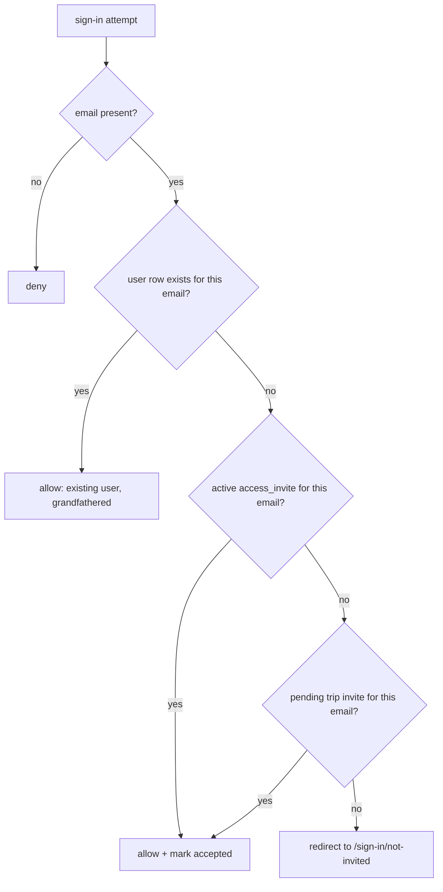

# Plan — Invite-only registration, public preview, anonymous rate limiting

Status: **approved, scoped down** — 3 scrutinize passes applied; §2.5 decision taken
(env allowlist, `access_invite` deferred). No code written yet.
Ticket: **TP-0031** (`a-a9Ce0-g3Qx`, project `travel-planner-v2`, todo, high, @Claude).
Scope: `app/` (Next.js 15/16 App Router, Auth.js v5 beta.31 / `@auth/core` 0.41.2, Drizzle + Neon)

## 1. Goal (restated)

1. **New accounts by invite only.** Anyone can reach the real URL, but only an invited
   address can complete registration.
2. **Existing users keep working.** No re-invite, no interruption.
3. **Public preview.** The production URL is shareable on social: a signed-out visitor
   sees real demo content (and a proper OG card), not a bare sign-in wall.
4. **Rate limit for non-active users.** Anonymous / non-authenticated traffic that hammers
   the app is throttled.

## 2. Evidence — what the code actually does today

Everything below was read in the repo at `main` (34791ce), not assumed.

| Fact | Evidence |
|---|---|
| No `signIn` callback exists; NextAuth config has only adapter/session/pages/providers | `app/src/lib/auth.ts:43-51` |
| Session strategy is `database` with the Drizzle adapter | `app/src/lib/auth.ts:45` |
| `AUTH_BYPASS` returns a fabricated session and upserts a dev user, bypassing Auth.js entirely | `app/src/lib/auth.ts:57-93`, `app/src/lib/feature-flags.ts` |
| `/` redirects signed-out visitors straight to `/sign-in` — no public surface | `app/src/app/page.tsx:18-20` |
| `/invite/[token]` (trip invite) also redirects anonymous visitors to `/sign-in` | `app/src/app/invite/[token]/page.tsx:69-71` |
| Trip invites are **trip-scoped** (`invite` table: `trip_id`, `email`, `token_hash`, `status`, `expires_at`), created by trip owners; there is no account-level invite concept | `app/src/db/schema.ts:501-525`, `app/src/app/actions/invites.ts` |
| Invite tokens are 32 random bytes, stored only as SHA-256 hash | `actions/invites.ts:15-27` |
| A rate limiter already exists, Postgres-backed atomic fixed window, but keyed on `token_id` which is the **primary key with an FK to `api_token`** — it cannot hold an IP key as-is | `app/src/lib/api/rate-limit.ts`, `app/src/db/schema.ts:666-674` |
| The allow/deny decision is already pure and unit-tested, reusable verbatim | `app/src/lib/api/rate-limit-policy.ts` (+ `.test.ts`) |
| There is **no `middleware.ts`** in the app | `find app/src -name middleware.ts` → none |
| `db` is Neon over HTTP (edge-capable); `dbNode` is TCP for scripts/migrations | `app/src/db/index.ts` |
| Migrations: `drizzle-kit generate` → commit SQL → `drizzle-kit migrate` in the production Vercel build only | `ARCHITECTURE.md` "Key constraints" |

### Auth.js internals verified in `node_modules` (not from memory)

Path: `node_modules/.pnpm/@auth+core@0.41.2_.../lib/actions/`

- **OAuth**: `callback/index.js:66-71` calls `handleAuthorized(...)` — i.e. the `signIn`
  callback — **before** `handleLoginOrRegister(...)` (line 72). So returning falsy in
  `signIn` prevents the `user` row from ever being created.
- **Magic-link request**: `signin/send-token.js:22-31` calls `callbacks.signIn({ user,
  account, email: { verificationRequest: true } })` **before** generating the token and
  calling `sendVerificationRequest`. So a blocked address never receives an email.
- **Magic-link click**: `callback/index.js:167-171` calls `handleAuthorized` again before
  `handleLoginOrRegister`. Both halves of the email flow are covered.
- **Return-value contract** (`callback/index.js:393-407`, `send-token.js:30-39`):
  falsy → throws `AccessDenied`; a **string** → treated as a redirect URL.
  **These are not equally usable — see §2.1.**
- In the OAuth branch the `user` passed to the callback is `userByAccount ?? userFromProvider`
  (`callback/index.js:57-70`) — for a brand-new visitor it is the raw provider profile, so
  `user.id` is meaningless there. **Only `user.email` is trustworthy as the gate key.**

**Conclusion:** `callbacks.signIn` in `app/src/lib/auth.ts` is the single correct
choke point. One gate covers Google and email, request and click.

### 2.1 The `signIn()` server action does not go through `/api/auth/*` — two consequences

`app/src/app/sign-in/page.tsx:38-44` and `:57-60` start both providers from **server
actions** calling `signIn(...)` from `@/lib/auth`. Tracing
`node_modules/next-auth/lib/actions.js:41-54`: that wrapper builds a `Request` and calls
`Auth(req, { ...config, raw, skipCSRFCheck })` **in-process**. No HTTP request is made to
`/api/auth/signin/*`.

**Consequence 1 — the gate must return a redirect string, never `false`.**
`@auth/core/index.js:123-125`: `if (isAuthError && isRaw && !isRedirect) throw error`.
The server-action path always sets `raw`, so an `AccessDenied` thrown by the gate
**propagates out of the server action** into Next's error boundary
(`app/src/app/error.tsx`) — a generic crash page, not `/sign-in/error`. Returning a
string instead makes `send-token.js:33-39` return `{ redirect }`, which
`actions.js:48-53` turns into a clean `redirect('/sign-in/not-invited')`.
(The OAuth *callback* leg does arrive over HTTP via `route.ts`, where `false` would
redirect correctly — but one consistent behaviour beats two.)

**Consequence 2 — rate-limiting by wrapping `route.ts` would miss the app's own
sign-in form.** The magic-link send — the one path with real cost (SMTP + a
`verificationToken` row) — never touches `/api/auth/*`. The limiter must sit **inside the
`/sign-in` server actions**, with the `route.ts` wrapper as a secondary guard for direct
HTTP hits. §3.4 reflects this.

## 2.5 The simpler alternative — read this before approving §3

Everything in §3.1 (a new table, migration, admin page, `/join/[token]`, token hashing,
claim-race handling) exists to answer one question: *is this email allowed to register?*

If the answer set is "a handful of people I know", the same gate is:

```
ACCESS_ALLOWLIST="a@x.com,b@y.com"   # env, comma-separated
```

plus the existing-user check. That is **one file** (`access-gate.ts`), no schema, no
migration, no admin UI, no `/join` page, no token, no race. Adding an invitee is a Vercel
env edit. It delivers 100% of "new users must be invited" — it only lacks a
*self-service* invite link and an audit trail of who invited whom.

**DECIDED (2026-08-15, by the user): env allowlist first.**
`access_invite`, `/join/[token]`, `/settings/access` and the whole token/claim/race
apparatus are **out of this phase**. §3.1 below is retained as the documented upgrade
path — the gate's public surface (`hasGrant(email)`) is identical either way, so nothing
built now is thrown away when the table lands later.

Shape of the shipped gate:

```
ACCESS_ALLOWLIST="a@x.com,b@y.com"   # env, comma-separated, lowercased+trimmed on read
INVITE_ONLY=true                      # kill switch, default false
```

`hasGrant(email)` = existing `account` row → existing `user` row → allowlist membership →
pending unexpired row in the existing `invite` table (trip invites, §3.1). No new tables
for the gate. The only schema change left in this phase is `rate_limit` (§3.4).

## 3. Design

### 3.1 The gate



> **Deferred — not built in this phase (see §2.5).** Kept as the upgrade path for when
> self-service invite links are wanted.

New table `access_invite` (account-level, distinct from the trip-level `invite`):

| col | type | note |
|---|---|---|
| `id` | text pk | uuid |
| `email` | text not null | normalised lowercase, unique index |
| `status` | enum `pending/accepted/revoked/expired` | mirrors `invite_status` naming |
| `token_hash` | text unique | for the shareable `/join/<token>` landing page |
| `invited_by` | text → `user.id` on delete set null | |
| `expires_at` | timestamp not null | default 30 days |
| `accepted_at`, `accepted_user_id` | nullable | audit |
| `created_at` | timestamp not null default now | |

**Email-bound by default.** The invite names an address; the link is a convenience, not
the credential. This avoids depending on cookie state surviving the OAuth round trip
(see the risk in §6), and makes the gate a single indexed lookup on `user.email` /
`access_invite.email`.

*(end of the deferred section — everything below is in scope for this phase.)*

Grandfathering is *derived*, not a backfill — nothing to migrate, and it cannot drift.
But it must **not** be keyed on email alone. `users.email` is **nullable**
(`schema.ts:33`), so an existing user whose row has a null email would be locked out the
moment `INVITE_ONLY` flips. The gate therefore asks two questions, in order:

1. **OAuth** — does an `account` row already exist for
   `(account.provider, account.providerAccountId)`? This is the exact condition under
   which `@auth/core` itself resolved `userByAccount` (`callback/index.js:57-64`), it is
   independent of email, and it cannot lock out an already-linked account.
2. **Any provider** — does a `user` row exist with this (lowercased) email?

Either ⇒ existing user ⇒ allow. Before flipping the flag, run
`select count(*) from "user" where email is null` in production and confirm the number,
rather than assuming it is zero.

Email comparison is lowercase on both sides. `@auth/core`'s `defaultNormalizer`
(`send-token.js:74-90`) already lowercases and trims the magic-link address and rejects
quoted locals; `createInviteAction` lowercases too (`actions/invites.ts:34-36`). Google
profile emails are not normalised by Auth.js, so the gate must lowercase explicitly.

Trip invites stay first-class: `hasGrant(email)` also accepts a `pending`, unexpired
row in the existing `invite` table. **Decided (was an open item): read the `invite`
table directly; do not dual-write an `access_invite` row from `createInviteAction`.**
One extra indexed query beats two tables that can drift. Without this, a trip owner inviting a collaborator
who has no account would produce a dead link — a regression the gate would otherwise
introduce.

### 3.2 Kill switch

`INVITE_ONLY` env flag via `FEATURE_FLAGS` (`app/src/lib/feature-flags.ts`, same
`readBool` helper). Default **off**; flipped on in Vercel production after the invites
for existing collaborators are seeded. Instant rollback without a deploy is *not*
available (flags are read at module load — documented in that file), so rollback = flip
env + redeploy, which is one Vercel action.

### 3.3 Public preview

- `/` becomes: signed-in → today's trip list (unchanged code path); signed-out → a public
  landing page. The `redirect('/sign-in')` at `page.tsx:20` is what changes.
- `/demo` — **deferred to a follow-up, not part of this phase.** Reason (traced, not
  assumed): `app/src/app/trip/[id]/page.tsx:26-36` imports and passes mutation server
  actions (`addPlaceInlineAction`, `removePlaceAction`, `reorderPlacesAction`,
  `updatePlaceNoteAction`, `optimizeRouteAction`, `setSegmentModeAction`,
  `setHotelLegModeAction`) down into the itinerary components, and gates on
  `getTripRole` / `canWrite`. A read-only public variant is a parallel component tree,
  not a flag — it is the single largest and riskiest item in this plan (see R7) and it
  is not what "shareable URL with preview content" needs.
  The landing page carries the preview instead: real screenshots of the itinerary,
  calendar, budget and map, plus the OG card. That is ~90% of the social-preview goal at
  ~10% of the risk. Revisit `/demo` once the gate is live.
- `app/opengraph-image.tsx` + `twitter-image` so the shared URL produces a real card
  (today only `icon.jpg` / `apple-icon.jpg` exist). Smaller than it looks:
  `app/src/app/layout.tsx:29-41` already sets `metadataBase` from
  `NEXT_PUBLIC_SITE_URL` / `VERCEL_PROJECT_PRODUCTION_URL`, explicitly for file-based
  opengraph routes — the absolute-URL problem is already solved.
- Root layout needs **no change**: `layout.tsx` reads only the `theme` cookie, never
  `auth()` (traced) — so a signed-out page renders fine inside it.
- `/sign-in/not-invited` — a plain page explaining access is invite-only, with a way to
  request access.
- `/join/[token]` — landing for an invite link: resolves the token hash, shows which
  address was invited (masked, e.g. `w•••@gmail.com`), and sends the visitor to
  `/sign-in`. It grants nothing by itself; the gate still decides.

### 3.4 Rate limiting anonymous traffic

Reuse the proven mechanism, generalise the key:

- New table `rate_limit(key text primary key, window_start timestamptz not null default
  now(), count integer not null default 0)` — same shape as `api_rate_limit` but without
  the FK that makes the existing table token-only.
- New `consumeRateLimitKey(key, max, windowSeconds)` in `app/src/lib/api/rate-limit.ts`
  using the **same** atomic `INSERT … ON CONFLICT DO UPDATE … RETURNING` and the existing
  pure `decideRateLimit` from `rate-limit-policy.ts`. No new algorithm, no new tests for
  the decision logic.
- `api_rate_limit` is left alone. Folding it into the generic table is a follow-up; doing
  it here would churn a tested, shipped path for no user-visible gain.
- **Key** = `${bucket}:${sha256(ip + RATE_LIMIT_IP_SALT)}`, truncated. Hashing the IP keeps
  a raw-IP log out of Postgres. IP from `x-forwarded-for` (first hop) on Vercel; in local
  dev the header is spoofable and the limit is best-effort — documented, not pretended away.
- **Where it runs** — deliberately *not* global middleware, because every checked request
  costs one Neon round trip and middleware would tax static assets and signed-in users too:

  | Bucket | Point | Suggested budget |
  |---|---|---|
  | `signin` | **inside the two `/sign-in` server actions** (primary, see §2.1), plus a wrapper on POST `/api/auth/signin/*` — never `/callback/*` | 10 / 10 min per IP |
  | `join` | `/invite/[token]` loads (`/join/[token]` is deferred with §3.1) | 30 / 10 min |
  | `anon` | public `/` | 120 / 10 min |

  `/api/auth/callback/*` is deliberately excluded: a 429 there aborts an in-flight OAuth
  round trip for a legitimate user who already authenticated at Google, and the callback
  is not the flood surface — the signin POST is. `route.ts` today is
  `export const { GET, POST } = handlers` (2 lines), so wrapping is a small hand-written
  `POST` that inspects `req.nextUrl.pathname` and delegates to `handlers.POST`.

  **Verified, so it is not over-engineered:** an anonymous request costs *no* adapter
  call — `@auth/core`'s session action returns early when there is no session cookie
  (`lib/actions/session.js:19`). So anonymous hits on server actions and gated pages fall
  through to a `redirect`/throw without touching Postgres. There is no need to blanket
  the app with limiter checks; the three buckets above are the whole surface.

  **Table growth:** unlike `api_rate_limit` (bounded by token count, FK-cascaded),
  `rate_limit` keys are hashed IPs and grow without bound. Add a Vercel cron
  (`vercel.json` / `vercel.ts` `crons`) hitting an internal route that runs
  `delete from rate_limit where window_start < now() - interval '1 day'`. Without this
  the table grows forever — a real gap, not a nicety.

  All budgets `posIntEnv`-tunable, matching the existing convention.
- **Authenticated users bypass**: check `auth()` first; a valid session skips the limiter,
  so "active users" are never throttled by this.
- The public landing should be statically rendered / cached so the cheap path stays cheap
  and the limiter is a backstop, not the primary defence.
- Worth evaluating alongside, not instead of: Vercel Firewall / BotID rate rules run at
  the edge with zero DB cost. If ops is willing to configure it, the `anon` bucket above
  is redundant. Keep the `signin` bucket regardless — it is auth logic, not traffic shaping.

### 3.5 Who can invite

**This phase:** whoever can edit Vercel env vars — adding an address to
`ACCESS_ALLOWLIST` *is* the invite. No admin UI, no `user.role` column.

**Deferred** (with §3.1): `ACCESS_ADMIN_EMAILS` gating a `/settings/access` page that
creates invites and copies `/join/<token>` links.

### 3.6 The rejection page — `/sign-in/not-invited` (decided: long + polite)

Both providers land here (the gate returns this path as its redirect string, §2.1), so
there is exactly one copy to write and one page to maintain.

Draft copy — warm, explains the *why*, gives a next step, never blames the visitor:

> **You'll need an invite for this one**
>
> Traver Planel is in a small private phase right now, so new accounts are opened by
> invite only. Nothing is wrong with your account or with the link you followed — we
> just haven't opened the doors to everyone yet.
>
> If someone told you to expect access, ask them to add the email address you just
> tried, then come back and sign in again — it'll work straight away.
>
> If you found us from a post and want to try it: **[request access]**.
>
> Thanks for the interest. We'd rather open up slowly and keep the app good than open
> up fast and break it.

Notes for implementation:
- The page must **not** echo the attempted email address back into the HTML. The copy
  says "the email address you just tried" precisely so nothing needs to be passed in a
  query string, where it would end up in logs and in the browser's history.
- "Request access" is a `mailto:` to an ops address in this phase — a form would need
  storage, its own rate limit and spam handling, which is not worth it yet.
- Copy goes through the existing i18n layer (`lib/i18n.ts`, `messages/`) like the rest
  of the app; EN + TH.
- **Accepted trade-off (R2):** an invited address reaches the verify-request page while
  an uninvited one reaches this page, so an attacker can distinguish the two. With an
  allowlist of a handful of known people this is a small, deliberate loss. Revisit if
  the allowlist ever becomes large or sensitive.

## 4. Files touched

| File | Change |
|---|---|
| `app/src/db/schema.ts` | `+ rateLimits` only (no `access_invite` this phase) |
| `app/drizzle/*` | generated migration (committed) |
| `app/src/lib/auth.ts` | `+ callbacks.signIn` gate |
| `app/src/lib/access-gate.ts` | **new** — `hasGrant(email, account)`, email normalisation, allowlist parsing |
| `app/src/lib/feature-flags.ts` | `+ inviteOnly`; allowlist parsed here or in `access-gate.ts` |
| `app/src/lib/api/rate-limit.ts` | `+ consumeRateLimitKey` |
| `app/src/lib/anon-rate-limit.ts` | **new** — IP extraction + hashing + buckets |
| `app/src/app/sign-in/page.tsx` | `signin` rate-limit check inside both server actions (§2.1) |
| `app/src/app/api/auth/[...nextauth]/route.ts` | secondary wrapper for direct HTTP signin POSTs |
| `app/src/app/page.tsx` | signed-out → public landing instead of redirect |
| `app/vercel.json` (or `vercel.ts`) | `+ cron` to prune `rate_limit` |
| `app/src/app/api/internal/prune-rate-limit/route.ts` | **new**, cron target |
| `app/src/app/sign-in/not-invited/page.tsx` | **new** — copy in §3.6 |
| `app/src/messages/*` | `+ not-invited` strings, EN + TH |
| `app/src/app/opengraph-image.tsx` | **new** (`metadataBase` already set in `layout.tsx:40`) |
| ~~`app/src/app/join/[token]/page.tsx`~~, ~~`settings/access/**`~~ | **deferred** with §3.1 |
| `app/src/app/actions/invites.ts` | **unchanged** — the gate reads the `invite` table directly (§3.1) |
| `REQUIREMENTS.md` §11/§12, `ARCHITECTURE.md`, `AGENTS-INDEX.md`, `app/.env.example` | doc + env updates in the same PR (repo convention) |

## 5. Sequencing

0. **Spike (½ day)** — write the `signIn` callback returning a **redirect string** (never
   `false`, per §2.1), verify by
   hand in dev with `AUTH_BYPASS=false`: (a) Google, unknown email → not-invited page, no
   `user` row created; (b) magic link, unknown email → no email sent; (c) invited email →
   both providers succeed. This validates §2 before anything is built on it.
1. `access-gate.ts` (allowlist parse + `hasGrant`) + unit tests. No schema change.
2. `signIn` callback behind `INVITE_ONLY`, default off + `/sign-in/not-invited`. Ship —
   nothing changes in prod yet.
3. `rate_limit` table + migration + `consumeRateLimitKey` + `anon-rate-limit.ts` +
   `signin` bucket in the `/sign-in` server actions.
4. Public landing + OG image + `anon` bucket + `rate_limit` prune cron.
5. Audit prod: `select count(*) from "user" where email is null`; fill `ACCESS_ALLOWLIST`
   with known collaborators; then flip `INVITE_ONLY=true` in production.
6. *(follow-up phase)* `access_invite` table + `/join/[token]` + admin UI (§3.1), `/demo`.

Steps 3–4 are independent of 1–2 and can run in parallel.

## 6. Risks and open questions

| # | Risk | Handling |
|---|---|---|
| R1 | **The gate trusts provider email.** Google verifies its addresses, but Auth.js maps `profile.email` without checking `email_verified`. | Assert `profile.email_verified` for Google inside the callback. **Verified implementable:** `lib/actions/callback/oauth/callback.js:209-210` returns the *raw* profile (id-token claims / userinfo) alongside the mapped user, and `callback/index.js:66-70` passes it to the gate — so `email_verified` is present. |
| R2 | **Email enumeration.** A blocked magic-link request redirects to the not-invited page, so an attacker can tell an invited address from an uninvited one. | **Accepted, not mitigated** (user decision, Q1): explicit polite page for both providers, §3.6. Cheap to reverse later — it is one branch in the gate's return value. |
| R3 | Cookie-carried **open** invite links are out of scope. Feasibility looks better than first assumed — `next-auth/lib/actions.js:44` calls `cookies()` in the same request context that invokes `Auth()`, and the OAuth callback leg runs in a route handler where `cookies()` is readable — but "reading a cookie inside `callbacks.signIn`" is still unverified. | Still out of scope; email-bound invites need no cookie. Spike it only if Q3 comes back "open links wanted". |
| R4 | `AUTH_BYPASS=true` bypasses Auth.js completely, so the gate does not apply in that mode. | Correct and intended for local dev. Add a comment; ensure the flag stays off in prod (already documented in `feature-flags.ts`). |
| R5 | **Concurrent claim** of one invite. | `UPDATE … SET status='accepted' WHERE id=? AND status='pending' RETURNING` — single atomic statement, same discipline as the existing limiter. |
| R6 | Existing user with an email-only account signs in via Google → Auth.js `OAuthAccountNotLinked`. | Pre-existing behaviour, **not** caused by this change. Do not silently "fix" it here. |
| R7 | `/demo` accidentally exposing a mutation or a real user's trip. | **Removed from scope** (§3.3). If revived: dedicated read-only route, explicit test that `POST` to demo paths 403, `DEMO_TRIP_ID` pointing at an ops-owned seeded trip. |
| R10 | Existing users with `email is null` locked out at flip. | Gate checks the `account` table first (§3.1); prod count audited in step 6. |
| R11 | `rate_limit` table grows without bound. | Prune cron (§3.4). |
| R12 | A 429 on the OAuth callback would break a legitimate in-flight sign-in. | Callback path excluded from the limiter (§3.4). |
| R13 | Returning `false` from the gate crashes the sign-in server action into `error.tsx` instead of showing a rejection page. | Gate returns a redirect string; a test asserts the not-invited page is reached, not a thrown error (§2.1). |
| R14 | Rate limiter placed only on `route.ts` would be dead code for the app's own sign-in form. | Limiter lives in the `/sign-in` server actions (§2.1, §3.4). |
| R8 | Per-request DB write for anonymous limiting adds latency and Neon usage on the public pages. | Buckets are coarse, `/demo` is cached, signed-in users bypass. Revisit with Vercel Firewall if traffic grows. |
| R9 | Migration runs only on production builds; a schema/code mismatch window exists if the code deploys before migrate. | `vercel-build` already runs `drizzle-kit migrate` **before** `next build` and fails the build on error (ARCHITECTURE.md) — no action needed, noted so it is not re-litigated. |

**Open questions for the user**

- ~~Q1 — R2: neutral or explicit rejection message?~~ — **answered 2026-08-15: the long,
  polite explicit message** (§3.6). This accepts the email-enumeration leak described in
  R2 as a deliberate trade-off, in exchange for a rejected visitor understanding what
  happened instead of staring at a dead end.
- Q2 — this plan now recommends screenshots on the landing page and defers the live
  `/demo` trip. Accept, or do you want the live demo in this phase despite the cost?
- ~~Q4 (§2.5): env allowlist vs. full `access_invite` table~~ — **answered 2026-08-15:
  env allowlist.**
- ~~Q3~~ — moot for now; open links ride along with the deferred `access_invite` work.
  Original wording: do you want single-use open links (`/join/<token>` grants to *whoever* opens it),
  or is email-bound sufficient? Email-bound is what this plan assumes.

## 6.5 What was reviewed, and what was not

Three scrutinize passes. Verified by reading real code, not memory:
`@auth/core` 0.41.2 signin/callback/session actions, `next-auth/lib/actions.js`,
`app/src/lib/auth.ts`, `app/src/app/page.tsx`, `app/src/app/layout.tsx`,
`app/src/app/sign-in/page.tsx`, `app/src/app/invite/[token]/page.tsx`,
`app/src/app/actions/invites.ts`, `app/src/lib/with-trip-auth.ts`,
`app/src/lib/api/rate-limit*.ts`, `app/src/db/{index,schema}.ts`,
`app/src/app/api/auth/[...nextauth]/route.ts`, `ARCHITECTURE.md`.

**Not verified — resolve during implementation:**

- Whether any production `user` row has `email is null` (step 6 audit).
- Whether `cookies()` is readable inside `callbacks.signIn` (only matters if Q3 = open links).
- Whether the `/api/v1` surface has any account-creating path. `requireApiUser`
  (`lib/api-auth.ts`) only resolves tokens belonging to existing users, and
  `src/app/api/me/route.ts` was not read line-by-line — read it before shipping the flag.
- Real-world SMTP/OAuth behaviour under the flag: only a manual run in a preview
  deployment settles this. The step-0 spike is not optional.

## 7. Definition of done

- Unknown Google account and unknown email address are both rejected, verified manually
  and in an integration test, with **no `user` row created** and **no magic link sent**,
  landing on `/sign-in/not-invited` (§3.6) — *not* on `error.tsx` (R13) — in EN and TH,
  with the attempted address absent from the URL and the page source.
- An existing user (created before the flip) signs in with no change in behaviour.
- A trip invite to an address with no account still works end-to-end.
- Signed-out `/` renders public preview content with a valid OG card (verified in a real
  social-card debugger, not just locally).
- Anonymous flood on `/api/auth/signin` returns 429 with `Retry-After`; a signed-in user
  doing the same is unaffected.
- `pnpm lint`, `pnpm typecheck`, `pnpm test` green.
- `REQUIREMENTS.md`, `ARCHITECTURE.md`, `AGENTS-INDEX.md`, `.env.example` updated in the
  same PR.
